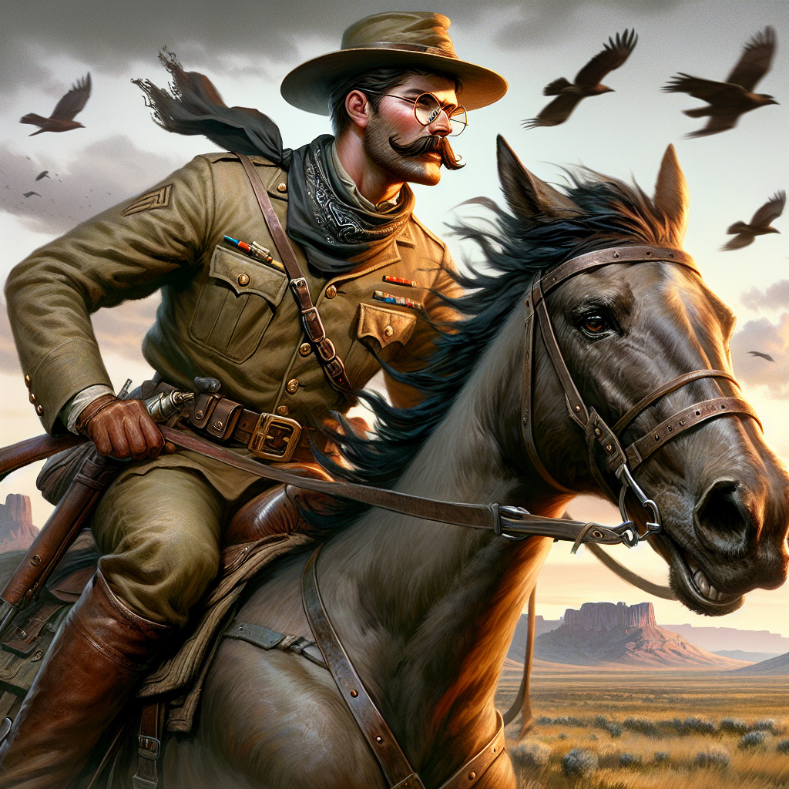
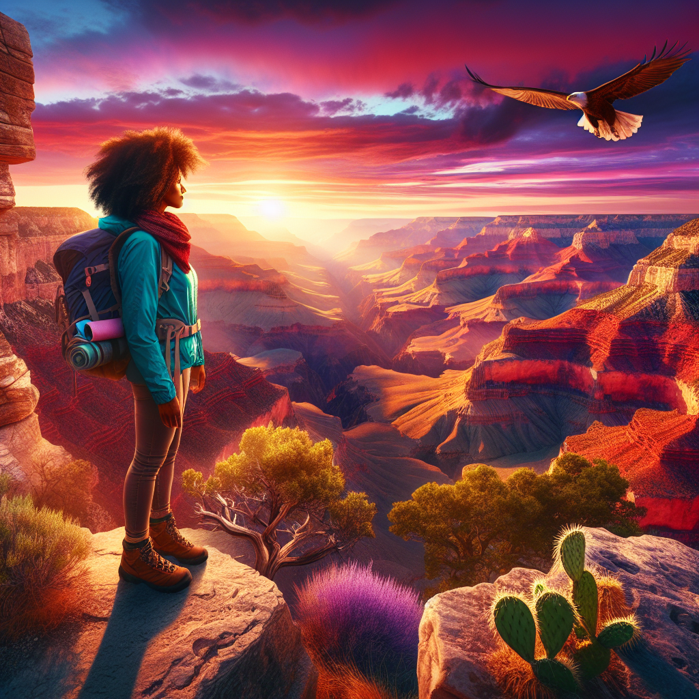

# Dall-E 3 Image Generation Enhancer with Exa
This is a tutorial for RAG with Exa results, in order to enhance prompts for image generation with Dall-E 3.

Here is the [Google Collab](https://colab.research.google.com/drive/1ZEuJRh7C8ClLYn4vafyu8Ae6hWV9JaB8?usp=sharing)


## What this doc covers

1. Using Exa's OpenAI wrapper to find relevant webpages for a image generation quey and execute a RAG query to generate a prompt
2. Making Prompting descisions that align with Exa's [prompting guide](https://docs.exa.ai/reference/prompting-guide)

---

In this tutorial, we will explore how to use Exa's semantic retrieval capabilities to create a prompt enhancer for image generation. We will use Exa's semantic retrieval capabilities to find the most relevant details and characteristics of the desired subject. 

This type of RAG (Retrieval Augmented Generation) is a powerful tool for enhancing the quality of image generation. By using Exa's semantic retrieval capabilities, we can provide relevant details to a LLM to generate prompts that can be used to generate more accurate and relevant images.

We will be feeding this prompt into Open AI's Dall-E 3 to generate images.

## Getting Started
Go ahead and install the required packages in collab or in the terminal:
```bash
## if you are using a Collab notebook
!pip install openai exa_py 
## else
pip install openai exa_py
```

## Importing the required packages
Import the required packages.
```python
from openai import OpenAI
from exa_py import Exa
```

## Setting up the Exa and OpenAI API keys
Set up the Exa and OpenAI API keys to use the APIs for the tutorial.
```python
# Set up the Exa API key
exa_api_key = "YOUR_EXA_API_KEY"
exa = Exa(exa_api_key)
# Set up the OpenAI API key
api_key = "YOUR_OPENAI_API_KEY"
openai_client = OpenAI(api_key=api_key)
```

## Get User Input
Let's get the user input for the image generation prompt.
```python
# Get user input
prompt = input("Image Prompt:")
```

## Instantiate the Exa OpenAI wrapper
Use the Exa OpenAI wrapper to setup a quick and easy RAG pipeline to generate a prompt for the image generation.
```python
# Instantiate the Exa OpenAI wrapper
exa_openai = exa.wrap(openai_client)
```

## Prompt Engineering
Let's prompt engineer the prompt for the image generation. According to Exa's [prompting guide](https://docs.exa.ai/reference/prompting-guide) we should:

 - Phrase as Statements: "Here's a great article about X:" works better than "What is X?"
 - Add Context: Include modifiers like "funny", "academic", or specific websites to narrow results.
 - End with a Colon: Many effective prompts end with ":", mimicking natural link sharing.

So I chose to phrase my prompt as a statement, with ":" at the end.

```text
Generate an image prompt for Dalle-3 with a vivid visual descrption of {prompt}. Be as detailed as possible with details about pose, posture, background, what and who the subject is, what they are wearing or the look of the subject, the subject could be anything, anywhere, or anyone. Here is a visual description of {prompt} for image generation: 
```

> To add more context I could use a LLM (such as GPT-4) to enhance this prompt as well that's fed into the Exa OpenAI wrapper.

## Generate and Output the prompt
Let's generate the prompt for the image generation.
```python
# Generate the prompt
completion = exa_openai.chat.completions.create(
        model="gpt-4o",
        messages=[{"role": "user", "content": f"Generate an image prompt for Dalle-3 with a vivid visual descrption of {prompt}. Be as detailed as possible with details about pose, posture, background, what and who the subject is, what they are wearing or the look of the subject, the subject could be anything, anywhere, or anyone. Here is a visual description of {prompt} for image generation: "}],
    )

print(completion.choices[0].message.content)
full_prompt = completion.choices[0].message.content
```

## Generate the image
Pass the prompt to OpenAI's Dall-E 3 to generate the image.
```python
# Generate the image
response = openai_client.images.generate(
  model="dall-e-3",
  prompt=full_prompt,
  size="1024x1024",
  quality="standard",
  n=1,
)
image_url = response.data[0].url
```

## Display the image (if in a notebook)
Let's see what we generated.
```python
from IPython.display import Image

Image(url=image_url)
```

## Example Output 1

### Query: 
"President Theodore Roosevelt"

### Generated Prompt: 
"Create an image of President Theodore Roosevelt in a dynamic and heroic pose, embodying the spirit of the Rough Riders era. The scene is set in the rugged American West, with vast, rolling plains and towering Rocky Mountains in the background, bathed in the warm glow of a setting sun. Roosevelt is mounted on a powerful, spirited horse, mid-gallop, as he embodies the essence of leadership and adventure.

He wears his iconic Rough Rider uniform: a khaki field jacket with brass buttons, a bandana tied loosely at his neck, and knee-high leather boots. A wide-brimmed cowboy hat sits atop his head, and his glasses glint in the sunlight, capturing the determination in his eyes. His mustache is well-groomed, and his expression is a mix of focus and excitement, as if he's leading a charge.

The wind ruffles his jacket and the mane of the horse, adding a sense of motion to the scene. Flanking him are a few fellow Rough Riders, similarly attired, showcasing camaraderie and teamwork. In the distance, a flock of birds takes flight, adding to the dynamic energy of the composition. The sky is a blend of oranges, pinks, and purples, reflecting the adventurous spirit of Roosevelt's era.



## Example Output 2

### Query: 
"Taylor Swift"

### Generated Prompt: 
"Create an image of a vibrant, whimsical portrait of Taylor Swift standing amidst a magical forest during golden hour. She is wearing a flowing, ethereal gown made of shimmering silks and lace, in shades of soft lavender and delicate blush pink. The gown beautifully catches the gentle sunlight filtering through the lush canopy, creating an enchanting glow around her. Her hair cascades in soft waves, adorned with small, wildflowers in subtle pastel colors that complement her attire.

Taylor Swift is poised gracefully beside an ancient, moss-covered tree, her gaze directed towards the sky, conveying a serene sense of wonder and inspiration. In her hands, she gently holds an intricately designed acoustic guitar, carved with motifs of woodland creatures and musical notes, hinting at her musical artistry.

In the background, ethereal light creates dappled patterns on the forest floor, where whimsical woodland creatures – like rabbits, deer, and delicate butterflies – peacefully wander. The air is filled with shimmering particles, almost like magic dust, enhancing the dreamlike quality of the setting. This enchanting scene captures Taylor Swift not just as a musician, but as a mythical muse, deeply connected with nature and creativity."


## Example Output 3

### Query: 
"Grand Canyon"

### Generated Prompt: 
"Create a vibrant and detailed image of the Grand Canyon at sunset, capturing its majestic beauty and awe-inspiring vastness. The scene is set from a high vantage point, overlooking the colorful layers of red, orange, and purple rock formations that stretch out to the horizon. The sky is an explosion of warm colors—fiery reds and oranges blending into soft pinks and purples. Sunlight bathes the canyon, casting dramatic shadows and highlighting rugged peaks and deep valleys.

In the foreground, a lone hiker stands on a rocky outcrop, looking out over the canyon with a sense of wonder and achievement. The hiker is a young woman, with wind-swept auburn hair, wearing a bright blue hiking jacket, sturdy brown hiking boots, and a light gray backpack. She stands confidently with her feet apart and hands on her hips, exuding a sense of adventure and exploration. Her expressive eyes are wide with awe as she gazes at the panoramic view in front of her, embodying the spirit of discovery.

Around her, small clumps of hardy desert vegetation, including prickly pear cactus and rugged bushes, emerge amidst the rocks, adding texture to the landscape. In the background, an eagle soars gracefully across the expansive sky, completing the breathtaking scene with a touch of wilderness and freedom. The overall atmosphere is one of tranquility, wonder, and the breathtaking beauty of nature's grandeur."




## Conclusion
In this tutorial, we explored how to use Exa's semantic retrieval capabilities to create a prompt enhancer for image generation. By using Exa's semantic retrieval capabilities, we can provide relevant details to a LLM to generate prompts that can be used to generate more accurate and relevant images.

As you can see, the Exa powered prompt enhance is able to generate a prompt that is more detailed and relevant to the subject. Both example images capture the essence of the subject, Teddy Roosevelt's ambition and Taylor Swift's musical artistry. This is a great example of how Exa can be used to enhance the quality of image generation.

We hope this tutorial has been helpful in understanding how to use Exa's semantic retrieval capabilities to create a prompt enhancer for image generation. If you have any questions or feedback, please don't hesitate to reach out. Thank you for using Exa!

Reach out to us at [hello@exa.ai](mailto:hello@exa.ai)